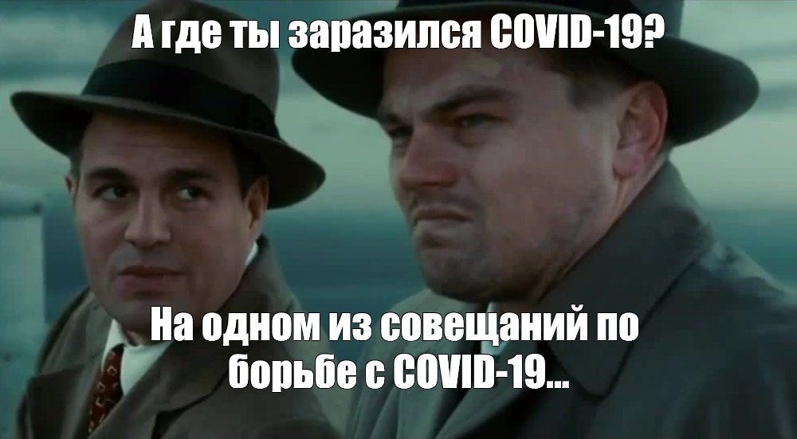

# Синтаксис Markdown

Маркдаун – облегченный язык разметки, созданный для написания, чтения, оформления веб-текстов.

## Оглавление

### Заголовки и горизонтальные линии

### Выделения текста

Чтобы выделить текст курсивом, необходимо обрамить его звездочками (*) или знаком нижнего подчеркивания(_). 

Например, *Вот так.* или _Вот так._

Чтобы выделить текст полужирным, необходимо обрамить его двойными звездочками (**) или двойным знаком подчеркивания (__). 

Например:

**Вот так.** или __Вот так.__

### Списки и отступы

Чтобы добавить ненумерованные списки, необходимо пункты выделить звездочкой (*). 

Например:

*Элемент 1

*Элемент 2

*Элемент 3

Чтобы добавить нумерованные списки, необходимо пункты просто пронумеровать.

Например:
1. Элемент 1
2. Элемент 2
3. Элемент 3

### Ссылки и картинки

Чтобы вставить изображение в текст, достаточно написать следующее:

### Цитаты и вставки кода

### Таблицы

В текст можно вставлять таблицы. Для этого используются всего два символа: вертикальная черта и дефис. Дефисы работают примерно так же, как в случае с горизонтальной линией: отделяют заголовки от других строк, при этом количество символов значения не имеет. Вертикальная черта служит границей между столбцами.

Пример – таблица меток для блоков кода, об этом было в предыдущем разделе:

| Язык | Метка |
| -----|------|
| Java Script | javascript |
| C++ |cpp|
| HTML|html|
|Markdown|md|
|JSON|json|
|Python|python|
|SQL|sql|
|Вопрос|Ответ|
|||
|||

### Чек-боксы

### Ссылки

Чтобы создать ссылку, необходимо написать:

[Ссылка на поисковик Яндекс](https://ya.ru)

### Экранирование

### Инструменты для работы с маркдаун-разметкой